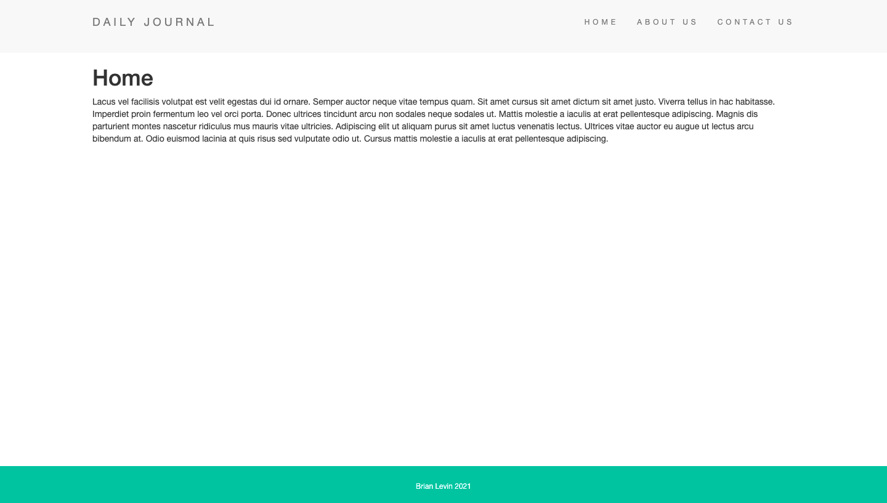
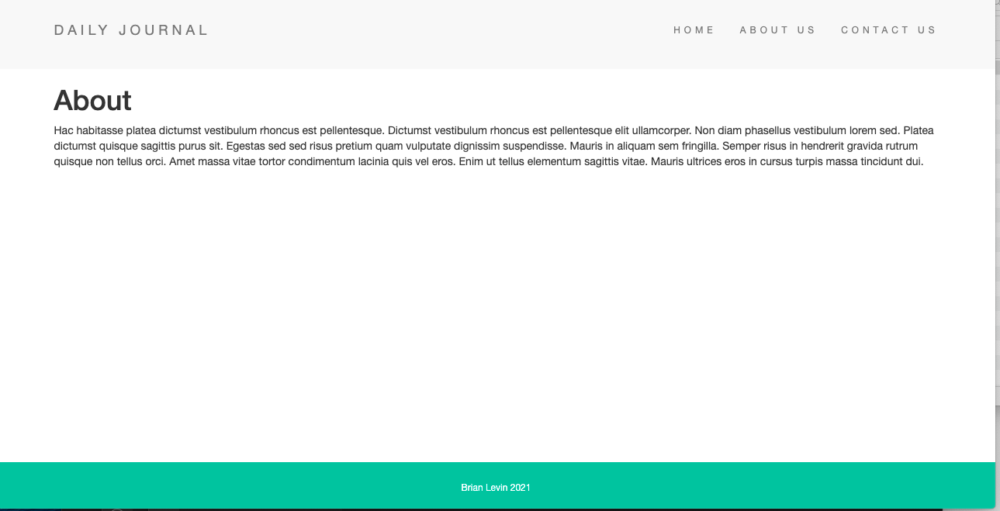
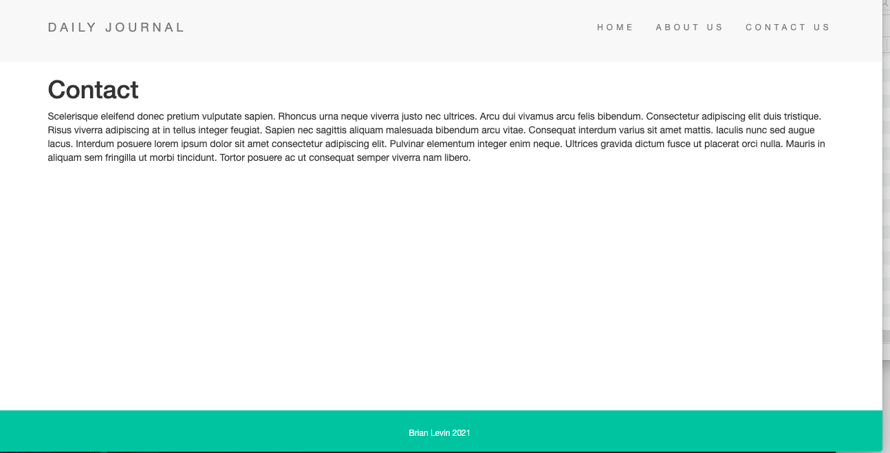
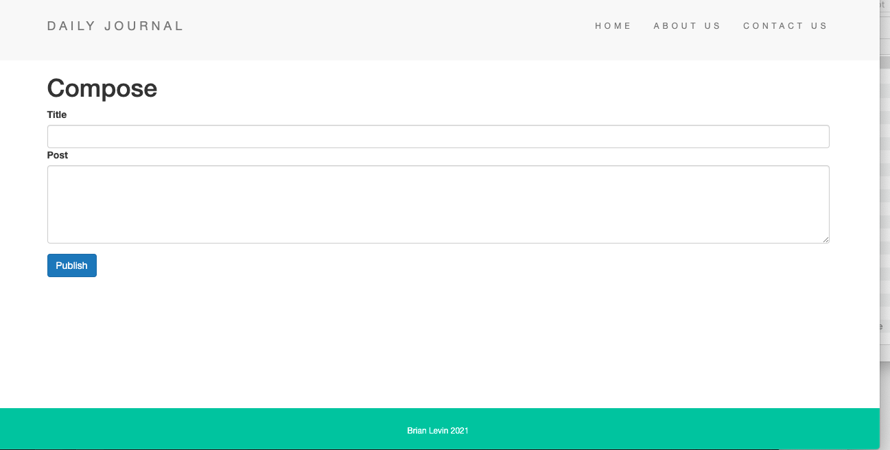
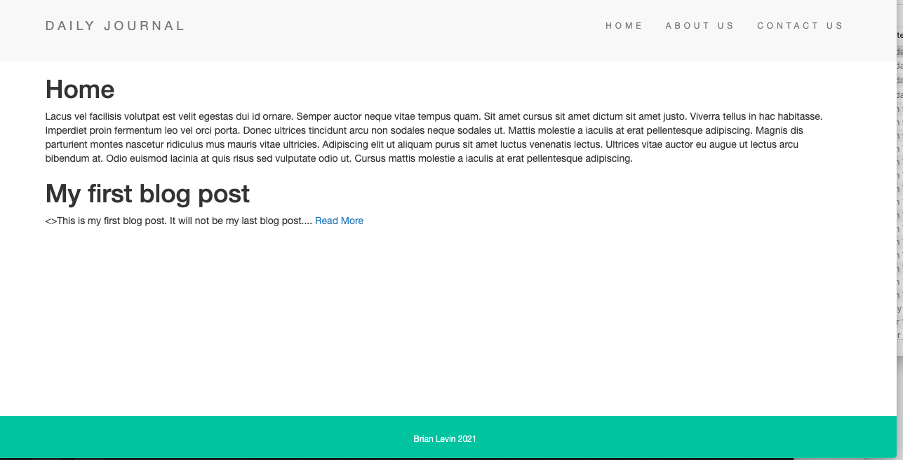
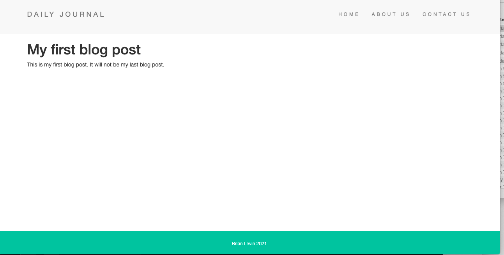

# Blog-Website-1

https://myy-blog-website.herokuapp.com/

## Application description:
An Express, Embedded Javascript (EJS), and Mongo application that allows the user to save and make blog posts. Each page  is displayed using EJS and each is stored in the Mongo Database.
 

 ## Click [here](https://myy-blog-website.herokuapp.com/) for the live app. 
 
 This is  the home page:
 
 
 
 This is the about and contact pages the user is routed to once they click those links on the navigattion tab:
 

  

This is the compose page once the user manually types it in the URL to that page:
 
  
  
  once published, the post is then displayed on the home pageL
      
    
    
The user can then go to the single blog post page by clicking read more: 
          
    
    
  
   
   
## Libraries and Frameworks:

- CSS
- Javascript
- EJS
- Node
- Express
- Mongo

## Email:

bml201095@gmail.com
